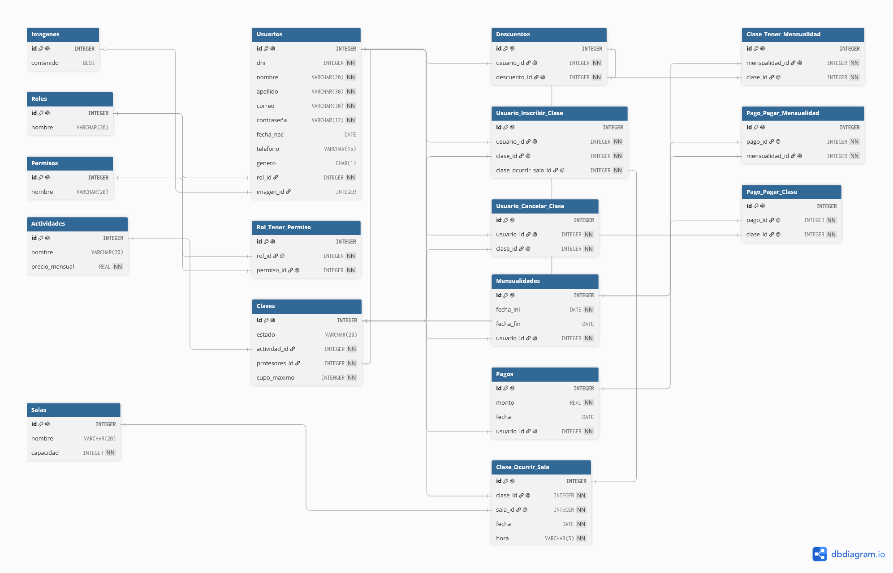

# Documentación backend

## Roles

- 1: Administrador
- 2: Recepcionista
- 3: Usuario

## API

### Servidor

El servidor se va a abrir en la dirección **http://127.0.0.1:5000**

### Endpoints

Autenticación

| **Dirección** | **Método** | **Datos necesarios** | **Códigos de respuesta** |
| --- | --- | --- | --- |
| /login | POST | correo, contraseña | 400: Usuario no encontrado   401: Contraseña incorrecta   500: Error interno del servidor / Error desconocido   200: Inicio de sesión exitoso. Se devuelve junto con el token JWT y la información de la cuenta. |
| /logout | POST | - | 200: Cierre de sesión exitoso |

Clases

| **Dirección** | **Método** | **Datos necesarios** | **Códigos de respuesta** |
| --- | --- | --- | --- |
| /clases | GET | - | 400: Error interno de consulta   401: No se encontraron clases   200: Se devuelve la lista de clases disponibles. |
| /clases | POST | estado, id_actividad, id_profesor, fecha, hora, sala, cupo_maximo | 400: Error en la consulta de disponibilidad de la sala   401: La sala ya está ocupada en la fecha y hora dadas   403: Error de servidor al insertar la clase   404: Error al insertar la relación en clase_ocurrir_sala   200: Clase publicada exitosamente. |
| /clases/(id_clase) | PUT | estado, id_actividad, id_profesor, fecha, hora, sala, cupo_maximo | 400: Error interno de consulta   401: Clase no encontrada   402: Error al modificar la clase   403: Error al modificar la relación clase_ocurrir_sala   200: Clase modificada exitosamente. |
| /clases/(id_clase) | DELETE | - | 400: Error interno de consulta   401: Clase no encontrada   402: Error al actualizar el estado a 'Borrado'   200: Clase eliminada exitosamente. |
| /clases/(id_clase) | PATCH | - | 400: Error interno de consulta   401: Clase no encontrada   402: Error al actualizar el estado a 'Cancelada'   200: Clase cancelada exitosamente. |
| /clases/(id_clase)/reservar | PUT | id_usuario, fecha, hora | 400: Error al consultar la clase   401: Clase no encontrada   402: Error al consultar clase_ocurrir_sala   403: Clase_ocurrir_sala no encontrada   404: Error al consultar el usuario   405: Usuario no encontrado   406: Error al verificar agendas del usuario   407: El usuario ya se encuentra inscripto en esa clase (u otra en el mismo horario)   408: Error al procesar el conteo de inscriptos   409: La clase no tiene más cupos disponibles   500: Error de servidor al registrar la inscripción   200: Reserva realizada exitosamente. |

Actividades

| **Dirección** | **Método** | **Datos necesarios** | **Códigos de respuesta** |
| --- | --- | --- | --- |
| /actividades | GET | - | 200: Se devuelve una lista con todas las actividades (vacía si no hay registros). |

Empleados

| **Dirección** | **Método** | **Datos necesarios** | **Códigos de respuesta** |
| --- | --- | --- | --- |
| /empleados | GET | - | 404: No se encontraron empleados   500: Error al obtener empleados   200: Se devuelve una lista de los empleados con su información personal y organizacional. |
| /empleados/desactivados | GET | - | 404: No se encontraron empleados desactivados   500: Error al obtener empleados desactivados   200: Se devuelve una lista de los empleados desactivados. |
| /empleados/recepcionistas | POST | dni, nombre, apellido, correo, contraseña, genero | 400: Error al obtener la lista de validación de correos   401: El correo electrónico ya se encuentra registrado para otro empleado   402: Error interno de base de datos al insertar el registro   403: El DNI ya se encuentra registrado para un empleado   200: El recepcionista ha sido creado con éxito. |
| /empleados/(empleado_dni) | PUT | nombre, apellido, correo, contraseña, fecha_nac, telefono, genero, rol_id | 500: Error al intentar modificar empleado   200: Empleado modificado exitosamente. |
| /empleados/(empleado_dni) | DELETE | - | 404: No se encontraron empleados   500: Error al intentar borrar empleado   200: Empleado borrado exitosamente. |
| /empleados/(empleado_dni)/desactivar | PATCH | - | 500: Error al intentar borrar/desactivar empleado   200: Empleado desactivado exitosamente. |
| /empleados/(dni)/rol | PUT | Id del nuevo rol | 400: El id del rol es obligatorio o el empleado ya posee dicho rol   404: El empleado no fue encontrado o el rol es inexistente   200: Rol actualizado correctamente. |

Profesores

| **Dirección** | **Método** | **Datos necesarios** | **Códigos de respuesta** |
| --- | --- | --- | --- |
| /profesores | GET | - | 200: Se devuelve una lista completa de los profesores registrados en el gimnasio. |
| /profesores | POST | dni, nombre, apellido, genero | 400: Error de base de datos o fallo al intentar insertar el profesor   200: Profesor creado con éxito de manera correcta. |

Salas

| **Dirección** | **Método** | **Datos necesarios** | **Códigos de respuesta** |
| --- | --- | --- | --- |
| /salas | GET | - | 200: Se devuelve una lista de las salas del establecimiento con sus identificadores. |

Pagos

| **Dirección** | **Método** | **Datos necesarios** | **Códigos de respuesta** |
| --- | --- | --- | --- |
| /pagos | GET | - | 400: No se encontraron pagos en el sistema   500: Error interno del servidor al procesar la lista   200: Se devuelve una lista global con todos los pagos registrados. |

Usuarios

| **Dirección** | **Método** | **Datos necesarios** | **Códigos de respuesta** |
| --- | --- | --- | --- |
| /usuarios | POST | dni, nombre, apellido, contraseña, fecha_nac, correo, telefono, genero, rol_id | 400: Errores de validación generales en inputs   401: Error interno de base de datos   402: El DNI ya se encuentra registrado   404: El correo electrónico ya se encuentra registrado   405: La fecha de nacimiento no cuenta con un formato válido (%Y-%m-%d)   406: El usuario debe ser mayor de 14 años   500: Error del lado del servidor al intentar insertar   201: Usuario registrado exitosamente. |
| /usuarios/(id_usuario)/perfil | GET | - | 400: Error interno de consulta   401: Usuario no encontrado   200: Se devuelve la información detallada del perfil del socio. |
| /usuarios/(id_usuario)/perfil | PUT | dni, nombre, apellido, fecha_nac, correo, telefono | 400: No se proporcionó ningún dato para actualizar   401: Error interno de consulta   402: Usuario no encontrado   403: Errores de validación en los campos enviados   404: Error en servidor al comprobar correos   405: El correo electrónico ya se encuentra registrado por otro usuario   406: No se proporcionó ningún dato nuevo/diferente para actualizar   500: Error del servidor al procesar la modificación   200: Perfil actualizado exitosamente. |
| /usuarios/(id_usuario)/pagos | GET | - | 400: Error interno de consulta   401: Usuario no encontrado   402: No se encontraron pagos asociados a este usuario   500: Error del servidor al consultar la facturación   200: Se devuelven las transacciones de pago del usuario. |
| /usuarios/(id_usuario)/contrasena | PUT | contraseña_actual, contraseña_nueva | 400: La nueva contraseña no cumple con las validaciones básicas de longitud o formato   401: Error interno de consulta   402: Usuario no encontrado   403: La contraseña actual es incorrecta   404: La nueva contraseña no puede ser igual a la contraseña actual   500: Error interno al modificar el registro   200: Contraseña modificada exitosamente. |
| /usuarios/(id_usuario)/avatar | POST | avatar | 400: El parámetro 'avatar' está vacío   401: Error interno de consulta de usuario   402: Usuario no encontrado   403: Error de servidor al intentar insertar la imagen   404: No se pudo insertar la imagen   405: Error al intentar asociar la imagen al usuario   500: Error interno de actualización   200: Avatar subido y asociado al usuario exitosamente. |
| /usuarios/(id_usuario)/avatar | GET | - | 400: Error interno de consulta de usuario   401: Usuario no encontrado   402: Error de servidor al consultar la imagen   403: El usuario no tiene un avatar asociado   200: Se devuelve el string/data del avatar del usuario. |
| /usuarios/(id_usuario)/permisos | POST | rol_id | 400: Error interno de consulta de usuario   401: Usuario no encontrado   500: Error al intentar modificar permiso   200: Permiso modificado correctamente. |

## Modelo lógico de la Base de Datos

## Testing

Para el testing se recomienda hacer archivos de Unit Test con la librería unittest de Python, y que estos archivos se guarden dentro de la carpeta **back/test_clases**. Esta librería provee una manera y un montón de funciones que permiten hacer el testing de la forma que lo haciamos en Java.
- Para ejecutar estos archivos, hay que correr en la terminal el siguiente comando: *python -m unittest <nombre_del_módulo_a_probar>*
- Se recomienda hacer los test cases por función.